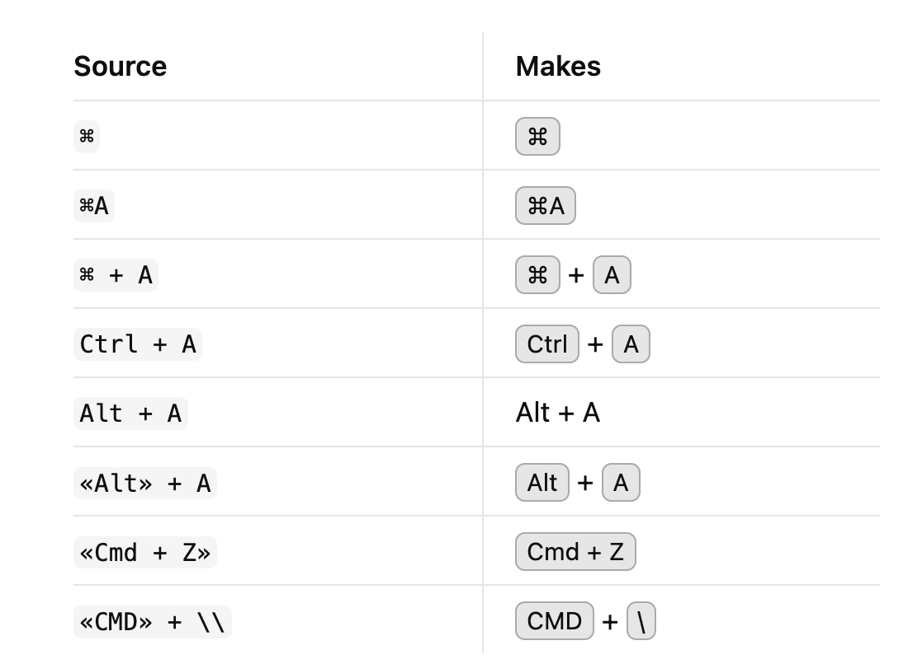

# Nice KBDs

This Obsidian plugin automatically detects keyboard shortcuts and wraps them in `<kbd>` tags, indicating a 'keyboard input'. For example, `⌘ + A` becomes <kbd>⌘</kbd> + <kbd>A</kbd>, making keyboard combinations clear and visually distinct (styles included).

Additionally, this plugin introduces a unique Markdown syntax for manually specifying keyboard inputs: `«CMD»` will become <kbd>CMD</kbd>.

## Auto Matching

This plugin assumes that:
- Key combos start with an identifiable 'key' (e.g. 'Ctrl', '⌘', '⇧'), which may be followed by any number of allowed characters.
- Key combos may contain additional keys separated by a plus sign ('+').
- Additional keys may include any allowed characters and do not have to start with an identifiable 'key'.

Examples:
- ⌘⇧A
- Ctrl+Shift+A
- ⌘ + ⌥ + F12

## Markdown Syntax

You may force a `<kbd>` by using the `«»` syntax. These wrapper characters are configurable.

This functionality works interoperably with the auto matching. Examples:
- «⌘⇧A»
- «Ctrl» + «Shift» «+A»
- «CMD» + OPT + F12

## Known Issues

- Trigger words should be stricter about word boundary, e.g., `Ctrl~` should not trigger a key combo.
- Backtick matching should be stricter, '⌘ + \\`' still comes out weird. Might just be a Markdown limitation though.

# 🎩

Credit to Ryota Ushio for answering my questions in [this feature request](https://forum.obsidian.md/t/plugin-api-expose-live-edit-functionality-for-extension/73447/7) and pointing me towards his plugin [Better Math in Callouts & Blockquotes](https://github.com/RyotaUshio/obsidian-math-in-callout/blob/master/src/decorations.ts) which I used to model the editor extension in this plugin.
